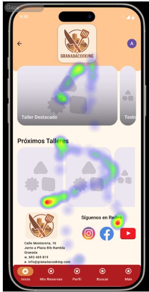
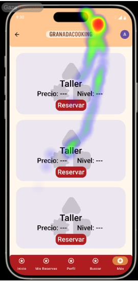

# Usability Report

#### Evaluación de usabilidad del proyecto 

### GranadaCooking

### 30/05/25

[[Enlace a GITHUB del proyecto](https://github.com/vikho22/UX_CaseStudy)]

### Realizado por:

[Informe realizado por Equipo DIU2_loscolegas]

Proyecto bastante completo, sin ninguna falta notable más que no se han enlazado los botones en algunas secciones.
Igual puede presentar algun que otro problema de contraste pero de manera general esta muy bien realizado.

## 1 DESCRIPCIÓN DEL WEBSITE

Esta APP ofrece una alta variedad de talleres de cocina y permite realizar reservas sobre ellas, pudiendose crear una cuenta dentro del sistema, iniciar sesión para acceder a los talleres reservados, y hasta un buscador dentro de la propia aplicación.

## 2 RESUMEN EJECUTIVO

En este documento se resaltan los datos de una investigación realizada con el fin de mostrar la usabilidad que posee la APP que ha realizado el grupo JCJ. Dentro de ella realizaremos varias pruebas, entre las cuales constan algunas como un test realizado en MAZE, otras como los cuestionarios SUS y por último la comprobación de la usabilidad auxiliandonos en la técnica de Eye Tracking, comprobando como reaccionan los usuarios ante los estímulos de la propia página en sí.

## 3 METODOLOGIA 

#### Metodología de usabililidad

[Metodología, sesiones,  técnicas aplicadas... ]

 

#### Test de usuarios: Participantes

| Usuarios | Sexo/Edad     | Ocupación   |  Exp.TIC    | Personalidad | Plataforma | Caso
| ------------- | -------- | ----------- | ----------- | -----------  | ---------- | ----
| Ivan Molina   | H / 20   | Estudiante  | Alta        | Chill        | Web        | B 
| Aitana        | M / 19   | Estudiante  | Baja        | Alegre       | Web        | B 

#### Resultados obtenidos

Report generado por MAZE
------
https://app.maze.co/report/New-maze-1/4kiyf7mb12dmmq/intro

Resultados del test SUS
------

SUS 
-----

Resultados del Eye Tracking
-----

Usuario 1
----

Usuario 2
----

## 4 CONCLUSIONES 
Viendo los resultados de las pruebas obtenidas podemos deducir algunos de los problemas que han podido surgir durante las distintas evaluaciones. Vemos que presentan una puntuación muy buena para usuarios con previo conocimiento TIC en los tests SUS, siendo esta de 87.5, superando con creces el baremo del puntaje minimo de 75 puntos, pero para un usuario con muy poco conocimientos esta puntuación baja drásticamente a 70, siendo esto probablemente por la falta de imagenes de los distintos talleres. Si nos fijamos en los tests realizados por MAZE vemos que los usuarios responden generalmente bien a las preguntas, dandonos a entender que el sitio web es facil de entender y utilizar. La única mayor pega que puede tener el proyecto la podemos ver en la prueba del Eye Tracking, donde vemos que los usuarios no reconocen algunos de los iconos importantes del sitio web en las páginas presentadas, dando a entender que estos elementos no estan bien posicionados o que no se les da la relevancia que realmente se les debería dar.

#### Incidencias

No se han presentado incidencias a la hora de realizar las pruebas

#### Valoración 

Observamos que la página esta bien diseñada y estructurada, presenta un diseño bonito y coherente con el ambiente del sitio web. La navegación es sencilla e intuitiva. Es una página bastante limpia y ordenada generando satisfacción en el usuario. El mockup esta completo, contemplando todos los aspectos diversos del sitio.

#### Recomendaciones y propuesta de mejoras: 

Se podrian mejorar algunos aspectos como que se presentan algunos botones en la barra de navegación principal, o en los iconos para volver hacia atrás que carecen de funcionamiento. El contraste se puede mejorar en algunos sitios mas pequeños y menos visibles de forma que al usuario no le cueste visualizar bien la información importante. También vemos que hay alguna página como la de contacto que se siente completamente vacía dejando mucho espacio sin rellenar. Finalmente vemos que se le podría dar mas relevancia a algunos iconos/imagenes para que el usuario centre toda su atención en las cosas mas importantes dentro de cada página,antes de que esta se pierda en otros estimulos que igual no interesa que reciban tanto peso. 

#### Valoración de la prueba de usabilidad (self-assesment)

La herramienta del Eye Tracking ayuda mucho para detectar los aspectos más visitados por los usuarios y ver si estos carecen de relevancia. Las pruebas de maze también ayudan a visualizar si el usuario comprende bien la pagína, indicandonos si esta se explica bien o no. Y finalmente el test SUS nos sirve para ver la satisfacción global del usuario, determinando si estos creen que es cómoda de usar o no. Si nos ceñimos al caso que estamos estudiando vemos que el uso combinado de estas tres técnicas nos ayuda enormemente para poder valorar correctamente si esta bien estructurada, para el cual vemos que en efecto esta muy bien realizada la práctica que nos ha tocado comprobar.
