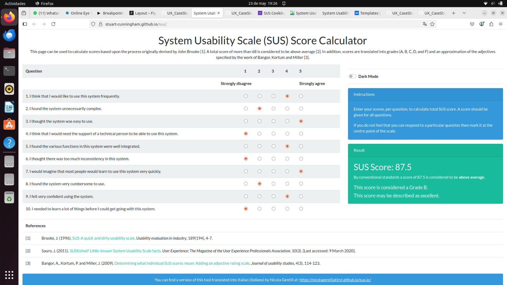
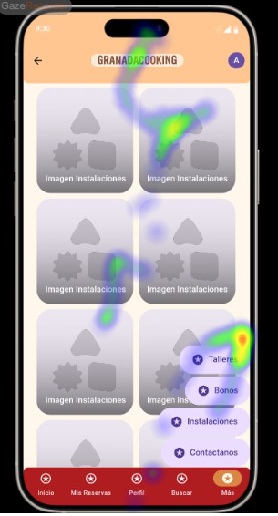
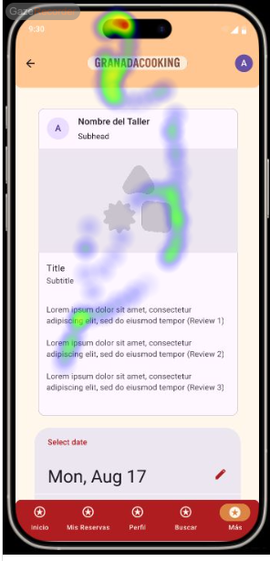

# Usability Report

#### Evaluación de usabilidad del proyecto 

### GranadaCooking

### 30/05/25

[[Enlace a GITHUB del proyecto](https://github.com/vikho22/UX_CaseStudy)]

### Realizado por:

[Informe realizado por Equipo DIU2_loscolegas]

Proyecto bastante completo, sin ninguna falta notable más que no se han enlazado los botones en algunas secciones.
Igual puede presentar algun que otro problema de contraste pero de manera general esta muy bien realizado.

## 1 DESCRIPCIÓN DEL WEBSITE

Esta APP ofrece una alta variedad de talleres de cocina y permite realizar reservas sobre ellas, pudiendose crear una cuenta dentro del sistema, iniciar sesión para acceder a los talleres reservados, y hasta un buscador dentro de la propia aplicación.

## 2 RESUMEN EJECUTIVO

En este documento se resaltan los datos de una investigación realizada con el fin de mostrar la usabilidad que posee la APP que ha realizado el grupo JCJ. Dentro de ella realizaremos varias pruebas, entre las cuales constan algunas como un test realizado en MAZE, otras como los cuestionarios SUS y por último la comprobación de la usabilidad auxiliandonos en la técnica de Eye Tracking, comprobando como reaccionan los usuarios ante los estímulos de la propia página en sí.

## 3 METODOLOGIA 

#### Metodología de usabililidad

[Metodología, sesiones,  técnicas aplicadas... ]

 

#### Test de usuarios: Participantes

| Usuarios | Sexo/Edad     | Ocupación   |  Exp.TIC    | Personalidad | Plataforma | Caso
| ------------- | -------- | ----------- | ----------- | -----------  | ---------- | ----
| Ivan Molina   | H / 20   | Estudiante  | Alta        | Chill        | Web        | B 
| Aitana        | M / 19   | Estudiante  | Baja        | Alegre       | Web        | B 

#### Resultados obtenidos

Report generado por MAZE
------
https://app.maze.co/report/New-maze-1/4kiyf7mb12dmmq/intro

Resultados del test SUS
------

SUS 
-----

Resultados del Eye Tracking
-----

Usuario 1
----

Usuario 2
----

## 4 CONCLUSIONES 
Viendo los resultados de las pruebas obtenidas podemos deducir algunos de los problemas que han podido surgir durante las distintas evaluaciones. Vemos que presentan una puntuación muy buena para los tests SUS, sienod esta de 87.5, superando con creces el baremo del puntaje minimo de 75 puntos. Si nos fijamos en los tests realizados por MAZE vemos que los usuarios responden generalmente bien a las preguntas, dandonos a entender que el sitio web es facil de entender y utilizar. La única mayor pega que puede tener el proyecto la podemos ver en la prueba del Eye Tracking, donde vemos que los usuarios no reconocen algunos de los iconos importantes del sitio web en las páginas presentadas.

#### Incidencias

* (indicad si algo ha fallado o no se ha podido realizar correctamente por algún motivo)

#### Valoración 

* (Puntos Positivos a destacar)

#### Recomendaciones y propuesta de mejoras: 

* (Puntos de mejora)

#### Valoración de la prueba de usabilidad (self-assesment)

(valoración personal de si han sido útiles estas técnicas para detectar errores ocultos o falllos de usabilidad en este caso )
