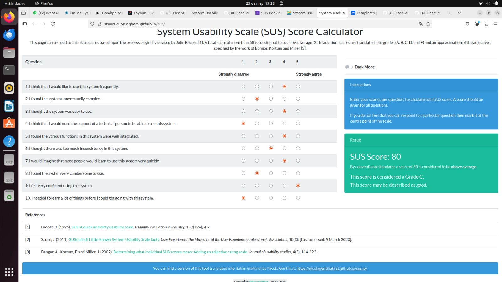

# DIU25
Prácticas Diseño Interfaces de Usuario (Tema: El ocio y comercio sostenible ) 

[Guiones de prácticas](GuionesPracticas/)

Grupo: DIU2.loscolegas.  Curso: 2024/25 

Actualizado: 21/03/2025

Proyecto: 

Rediseño de la página web

Descripción: 

Rediseñar la página web para que ofrezca una experiencia intuitiva y eficiente, que refleje la calidad de los talleres, facilite la navegación, simplifique la búsqueda y reserva de actividades, y permita a los usuarios gestionar sus inscripciones de forma autónoma y sin fricciones 

Logotipo: 

>>> Si diseña un logotipo para su producto en la práctica 3 pongalo aqui, a un tamaño adecuado. Si diseña un slogan añadalo aquí

Miembros:
 * :bust_in_silhouette:  José Manuel Medina Horta     https://github.com/jmedhor    
 * :bust_in_silhouette:  César Bautista García Díaz   https://github.com/cgardia1409

----- 

# Proceso de Diseño 

 

## Paso 1. UX User & Desk Research & Analisis 

### 1.a User Reseach Plan
 
-----

Vamos a realizar la investigación sobre un tema referido con la gastronomía y ocio de degustación dentro de Granada. Nosotros como grupo no tenemos experiencia previa a la hora de hacer evaluar los principios de usabilidad/experiencia de usuario ni sobre el impacto que puede tener la interfaz de usuario escogida dentro de los propios consumidores/público al que está dirigida. 

En nuestro caso vamos a escoger como ejemplo de análisis los talleres de comida (https://granadacooking.com). 
Para realizar dicha investigación vamos a adentrarnos dentro del perfil de las personas que acudirían a dicho servicio, observar su comportamiento realizando distintas tareas y analizar la usabilidad de la propia página. También vamos a observar los mismos comportamientos dentro de diversos comercios (en la competencia) viendo tanto sus diferencias principales como las fuerzas y debilidades principales de ambas.

### 1.b Competitive Analysis
 
-----

Tenemos que analizar las aplicaciones relacionadas con la gastronomía/ocio de degustación, vamos a explicar algunas de las carácteristicas de este tipo de aplicaciones:

Podemos analizar aspectos como el ambiente de los sitios mencionados, ya sea uno mas acogedor, cercano o tradicional como el de Bar la Goma o La Taberna de Kafka, u otros más festivos y movidos como el de Jardin Alhambra.

También nos podemos fijar en la enseñanza impartida en algunos sitios como en los talleres de cocina en Granada Cooking, o las conversaciones/actividades culturales que se pueden ver en La Tertulia.

De manera general este tipo de locales va enfocado a un ambiente mas relajado en el que el público que va principalmente concurre estos sitios para pasar un buen rato o incluso aprender algunas cosas sobre el mundo culinario.

Finalmente nosotros nos decidimos por escoger los talleres de cocina ya que nos parece un buen ejemplo para analizar los dinstitos usuarios que pudiesen adentrarse en este tipo de actividad, a la vez que creemos que dispone de una muy buena interfaz de cara a los clientes.

### 1.c Personas
 
-----

 
 Juan Garcia es un profesor de autoescuela de 36 años que es apasionado por el mundo del motor y la gastronomía. Es carismatico pero algo introvertido. Le gusta mucho pasar tiempo junto a su familia y siempre intenta cocinarles una buena comida para que disfruten. Juan se ha interesado por los talleres de cocina para mejorar su técnica y sorprender a su familia con nuevos platos.

 
Carlota Peŕez es una estudiante universitaria que estudia bellas artes. Siempre le ha encantado el mundo de la fotografía y hacer planes alocados junto a sus amigos. Se ha interesado por los talleres de cocina para aprender nuevas habilidades culinarias mientras disfruta un buen rato junto a sus amigos, al mismo tiempo que intenta capturar todos los momentos con fotos para luego subirlo a sus redes sociales.

### 1.d User Journey Map
 
----

Estas dos experiencias de usuario nos parecen que reflejan una situación que podría sufrir cualquier persona, dandonos opción a poder imaginar un comportamiento y una opinión que puede ser estandarizada para los usuarios que deseen asistir a estas actividades, y así poder visualizar posibles errores y cómo podríamos solucionarlos

### 1.e Usability Review
 
----

- Enlace al documento:  [Usability Review](P1/Usability_Review.xlsx)
- URL:  https://granadacooking.com/
- Valoración numérica obtenida:  85
- Comentario sobre la revisión:  Muy limpia y clara para el usuario, ofreciendo gran variedad de talleres, pero posee una función de busqueda bastante pobre, además buscar una fecha disponible para un taller concreto se hace muy tedioso

### Briefing

Vamos a realizar el análisis de usuario sobre la página escogida (granadacooking.com) como un experto en UX.

De primera vista la página ofrece una vista bonita y amigable para el usuario. Contiene explicaciones claras para lo que sirve la propia página. Ofrece rápidamente una elección de reserva de talleres, sin embargo, la fecha que se muestra esta pasada por mas de un año, lo cual indica que no esta muy actualizada.

Cuando intentas reservar un taller concreto, no te muestra directamente la fecha más próxima si no que te obliga a buscar dentro de un calendario cuando se puede realizar el taller, lo cual puede causar que el usuario se frustre. 

Contiene una función de búsqueda de talleres muy conveniente pero no siempre funciona ya que hay que ser medianamente especifico. Esto también puede causar que el usuario se piense que no existen talleres de lo que esta buscando. Se podrían añadir filtros que serían mas amigables para el usuario y también añadir una barra de búsqueda en vez una lupa para que la función sea más visible.

 

## Paso 2. UX Design  

### 2.a Reframing / IDEACION: Feedback Capture Grid / EMpathy map 
 
----

>>> Comenta con un diagrama los aspectos más destacados a modo de conclusion de la práctica anterior. De qué carece la competencia?? Tu diagrama puede ser una figura subida a la carpeta P2/

  
    
>>> Explica el Problema y plantea una hipótesis. Es decir, explica aquí qué 
>>> se plantea como "propuesta de valor" para un nuevo diseño de aplicación propio

### 2.b ScopeCanvas

----

### 2.b User Flow (task) analysis 
 
-----

Diagrama de flujo del procedimiento sencillo de un usuario al entrar a la página. El usuario tiene normalmente dos opciones, entrar a realizar una reserva en un taller, o bien acceder a consultar sus reservas realizadas, sobre las cuales tiene la opción de cancelar la reserva realizada previamente.

### 2.c IA: Sitemap + Labelling 
 
----

### 2.d Wireframes
 
-----

 

## Paso 3. Mi UX-Case Study (diseño)

>>> Cualquier título puede ser adaptado. Recuerda borrar estos comentarios del template en tu documento

### 3.a Moodboard

-----

Hemos utilizado la pagina de "Excalidraw" para representar nuestro tablón del moodboard. Las imágenes del logo y paleta de colores las podemos usar tanto para nuestra propia página como para publicitarlo en sitios como Instagram.

### 3.b Landing Page
 
----

### 3.c Guidelines
 
----
Pagina Home

Hemos usado una AppBar para completar la parte superior de la pagina. Un carrusel con Hero image para enfocar los talleres destacados. Un nav bar para la parte inferior de la pagina, indicando las otras paginas. Y por ultimo “Cards” para incitar al usuario que visite todos los talleres

Pagina Talleres

Mantenemos la nav bar en la parte inferior de la pagina, usamos Cards para mostrar todos los talleres y tambien nos auxiliamos de Text fields (Para los inputs de busqueda de filtros) y Chips para implementar los propios filtros

Pagina Taller

Nos apoyamos en un carrusel para mostrar fotos del taller indicado, así como de un boton para indicar la opción de “Reservar”

Pagina Login y registro

Usamos Text fields para que el usuario pueda introducir los datos y botones plantilla para mandar al usuario a la confirmación de inicio de sesión o al formulario de registro.

Pagina About us

Usamos “Cards” donde se ciclarán imagenes publicitarias de la propia empresa y campos de texto con información sobre la misma.
Se incluye un boton de FAQ 

### 3.d Mockup
 
----

Enlace al layout en figma: https://www.figma.com/design/dmVYoZrvEyf3kvb6o37RiM/Layout?node-id=0-1&t=TojYkhgNLlueGIPn-1

### 3.e ¿My UX-Case Study?
 
-----

>>> Publicar my Case Study en Github... Es el momento de dejar este documento para que sea evaluado y calificado como parte de la práctica
>>> Documente bien la cabecera y asegurese que ha resumido los pasos realizados para el diseño de su producto

 

## Paso 4. Pruebas de Evaluación 

### 4.a Reclutamiento de usuarios 

-----

>>> Breve descripción del caso asignado (llamado Caso-B) con enlace al repositorio Github
>>> Tabla y asignación de personas ficticias (o reales) a las pruebas. Exprese las ideas de posibles situaciones conflictivas de esa persona en las propuestas evaluadas. Mínimo 4 usuarios: asigne 2 al Caso A y 2 al caso B.

| Usuarios | Sexo/Edad     | Ocupación   |  Exp.TIC    | Personalidad | Plataforma | Caso
| ------------- | -------- | ----------- | ----------- | -----------  | ---------- | ----
| Javier        | H / 20   | Estudiante  | Alta        | Introvertido | Web.       | A
| Maatti        | H / 22   | Estudiante  | Alta        | Extrovertido | Web        | A 
| Ivan Molina   | H / 20   | Estudiante  | Alta        | Chill        | Web        | B 
| Aitana        | M / 19   | Estudiante  | Baja        | Alegre       | Web        | B 

### 4.b Diseño de las pruebas 
 
-----

Desarrollamos pruebas mediante Maze, además del cuestionario SUS y pruebas mediante el método de Eye tracking, comparando tanto nuestra página como la de nuestros compañeros usando el A/B Testing.

Enlace a las preguntas de Maze (otro grupo): https://app.maze.co/report/New-maze-1/4kiyf7mb12dmmq/intro

Enlace a las preguntas de Maze (nuestro): https://app.maze.co/report/Nuestro/d6e347mbazlt5w/intro

### 4.c Cuestionario SUS
 
----
SUS A

SUS B

### 4.d A/B Testing
 
-----

>>> Los resultados de un A/B testing con 3 pruebas y 2 casos o alternativas daría como resultado una tabla de 3 filas y 2 columnas, además de un resultado agregado global. Especifique con claridad el resultado: qué caso es más usable, A o B?

### 4.e Aplicación del método Eye Tracking 

----

Reclutamos nuestros usuarios en clase y utilizamos la aplicación gazerecorder.com para ver como reaccionan los usuarios ante nuestra propia página y la página diseñada por nuestros compañeros (caso B).

CASO B

Usuario 1
----

Usuario 2
----

CASO A

Usuario 1
----

Usuario 2
----

### 4.f Usability Report de B
 
-----

>>> Añadir report de usabilidad para práctica B (la de los compañeros) aportando resultados y valoración de cada debilidad de usabilidad. 
>>> Enlazar aqui con el archivo subido a P4/ que indica qué equipo evalua a qué otro equipo.

>>> Complementad el Case Study en su Paso 4 con una Valoración personal del equipo sobre esta tarea

 

## Paso 5. Exportación y Documentación 

### 5.a Exportación a HTML/React
 
----

>>> Breve descripción de esta tarea. Las evidencias de este paso quedan subidas a P5/

### 5.b Documentación con Storybook

----

>>> Breve descripción de esta tarea. Las evidencias de este paso quedan subidas a P5/

 

## Conclusiones finales & Valoración de las prácticas

>>> Opinión FINAL del proceso de desarrollo de diseño siguiendo metodología UX y valoración (positiva /negativa) de los resultados obtenidos. ¿Qué se puede mejorar? Recuerda que este tipo de texto se debe eliminar del template que se os proporciona 

